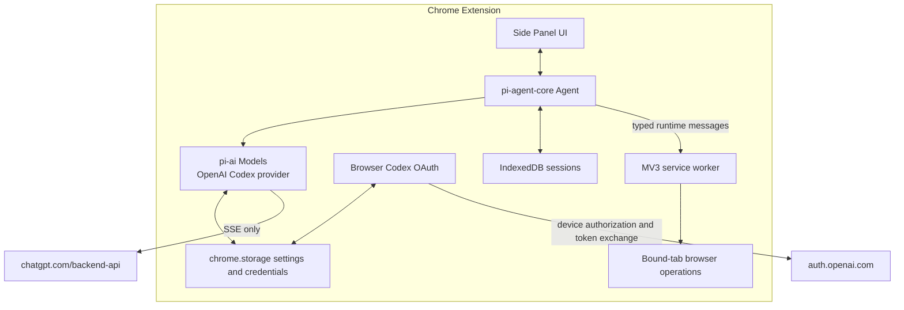

# Chrome-Native Codex Agent Plan

## Goal

Replace the local pi bridge with a Chrome-only assistant that runs `pi-agent-core` and `pi-ai` in a Side Panel, authenticates ChatGPT Plus/Pro through the OpenAI Codex device-code flow, and uses the existing bounded browser operations as agent tools.

The completed extension must not require a local pi process, loopback WebSocket, pairing secret, terminal UI, shell access, or local filesystem access.

## Context

The existing project has two runtimes:

- a Manifest V3 Chrome extension that owns tab binding, permissions, page operations, and WebMCP integration;
- a pi extension that owns the agent session and communicates with Chrome over an authenticated loopback WebSocket.

Browser-target bundling spikes established that:

- `pi-ai` provider factories can be bundled for the browser;
- `pi-agent-core` can be bundled for the browser;
- `openaiCodexProvider()` can be bundled for the browser;
- the complete `pi-coding-agent` package cannot be bundled because it depends on Node.js APIs;
- the current OpenAI OAuth implementation cannot be bundled directly because it includes `node:http` and `node:crypto` for the localhost callback flow.

The Codex device-code branch itself uses browser-compatible HTTP and PKCE operations, so the extension needs a browser-specific implementation rather than the existing Node OAuth module.

## Architecture

### Runtime ownership

- The Side Panel owns the live `Agent`, model stream, confirmation UI, and active session state.
- The service worker owns tab binding, Chrome permissions, context menus, page injection, screenshot capture, navigation tracking, and WebMCP calls.
- Content injected through `chrome.scripting` performs the existing bounded DOM operations; it never receives OAuth credentials.
- `chrome.storage.local` stores settings and the refresh credential, restricted to trusted extension contexts.
- IndexedDB stores session transcripts and metadata.
- Closing the Side Panel aborts the active run after preserving the last complete transcript state. Background continuation is not required.

### Authentication flow

1. Request only the OpenAI authentication and Codex API host permissions from an explicit user gesture.
2. Request a device code from `auth.openai.com`.
3. Display the verification URL and user code, and let the user open the verification page.
4. Poll according to the server-provided interval and handle pending, slowdown, expiry, cancellation, and denial states.
5. Exchange the returned authorization code and verifier for access and refresh tokens.
6. Extract and validate the ChatGPT account ID from the access-token claims.
7. Persist the credential without logging or exposing it to content scripts.
8. Refresh expired access tokens under a single-flight lock and atomically replace rotated refresh tokens.
9. Use SSE for Codex model requests; do not use browser WebSocket transport.

## Tech Stack

- Chrome Manifest V3 and Side Panel API
- Extension.js build pipeline
- `@earendil-works/pi-agent-core` for the agent loop
- `@earendil-works/pi-ai` with `openaiCodexProvider()` for models and Codex Responses
- Web Crypto for PKCE and identifiers
- `chrome.storage.local` and `chrome.storage.session` for settings, credentials, and transient state
- IndexedDB for session persistence
- Existing `chrome.scripting` page operations and optional WebMCP adapter
- Vitest for unit/integration tests and Playwright for extension E2E tests

## Non-Goals

- Anthropic, GitHub Copilot, API-key providers, or multiple-provider selection
- `pi-coding-agent`, `pi-tui`, local pi extensions, pi packages, or filesystem resource discovery
- Bash, native processes, local repositories, or arbitrary filesystem access
- Compatibility with the current loopback bridge protocol or pairing workflow
- Agent execution after the Side Panel is closed
- Browser WebSocket transport for Codex
- Dynamic or remotely hosted executable code
- Public Chrome Web Store release in the first implementation; provider and store policy review remains separate release work

## Assumptions

- The first release is a personal or unpacked extension using ChatGPT Plus/Pro.
- The Codex device-code endpoints and subscription access remain available to the client flow used by pi.
- Requiring the Side Panel to remain open during an agent run is acceptable.
- Existing tab binding, stale-context checks, permission checks, output limits, and confirmation rules remain product requirements.
- Page text and WebMCP output remain untrusted model input.

## Unknowns

- Whether Codex SSE requests from an installed extension succeed after Chrome removes forbidden headers such as `User-Agent`.
- Whether Extension.js emits browser-safe lazy chunks for the selected `pi-ai` provider without including the Node OAuth modules.
- The cleanest supported way to replace the provider's lazy Node OAuth object with a browser OAuth implementation while retaining `pi-ai` credential refresh behavior.
- The exact transcript recovery rule if Chrome closes the Side Panel between an assistant tool call and its tool result.
- Which session size and retention limits are appropriate for IndexedDB.

## Risks

- Codex subscription endpoints are not a stable public API and can change independently of this extension.
- Refresh tokens stored in a browser profile are less protected than credentials in an OS keychain.
- A Side Panel or browser crash can interrupt a stream or tool batch; incomplete messages must not be restored as completed work.
- Broad provider host permissions or leaking tokens into content-script messages would enlarge the security boundary.
- Removing the bridge changes the product shape and invalidates current protocol, pairing, and pi-package documentation and tests.
- Large screenshots and transcripts can exceed model, message, or browser-storage limits unless bounded before persistence and prompting.

## Plan

### 1. Prove the browser-only Codex boundary

- [x] Add an isolated browser-target build probe for `pi-agent-core`, `openaiCodexProvider()`, and the Codex SSE implementation; require a successful production build with no unresolved Node built-ins and record the generated chunk inventory.
- [ ] Build a temporary authenticated extension-origin probe for one Codex SSE request; verify streaming text, abort behavior, required headers after Chrome filtering, and a tool-call response in an explicitly documented manual test.
- [x] Exercise the complete device-code sequence from an extension page without calling the existing Node OAuth loader; verify login, denial, expiry, cancellation, refresh, and logout against mocked endpoints, plus one manual login against OpenAI.
- [x] Decide and document the browser OAuth integration seam in `pi-ai`—provider auth replacement or a browser-owned credential resolver—based on the probes; verify that normal model requests and automatic refresh use the same persisted credential.

### 2. Establish the Chrome-native application shell

- [x] Add a Side Panel entry point and manifest configuration; verify it opens from the extension action and remains usable while the bound tab navigates.
- [x] Define typed internal messages between the Side Panel and service worker for tab metadata, page operations, confirmations, progress, cancellation, and tab-change events; verify malformed and unknown messages are rejected.
- [x] Move bridge-independent tab state and browser-operation dispatch behind the internal message API while preserving stale-context checks; verify existing page-operation and navigation tests still pass.
- [x] Route context-menu selection events to the Side Panel session instead of pi; verify selected text is truncated, marked as untrusted, and queued only after explicit user action.

### 3. Implement Codex authentication and credential storage

- [x] Implement browser-safe PKCE, device authorization, polling, token exchange, account-ID extraction, and refresh modules; verify deterministic parsing tests and mocked success/error flows.
- [x] Implement a persistent `pi-ai` `CredentialStore` backed by `chrome.storage.local`, with serialized per-provider mutations and atomic refresh-token replacement; verify concurrent refresh requests perform one effective refresh.
- [x] Restrict credential storage to trusted extension contexts and ensure runtime messages, logs, tool results, sessions, and exported diagnostics redact tokens; verify with security-focused tests over serialized outputs.
- [x] Add login status, login, cancellation, expiry, refresh failure, and logout UI to the Side Panel; verify logout clears persistent and in-memory credentials before another request can start.
- [x] Request only `auth.openai.com` and `chatgpt.com` host access from an explicit login gesture and update CSP `connect-src` accordingly; verify model and auth calls fail clearly when permission is absent or revoked.

### 4. Create the browser agent runtime

- [x] Construct a single Side Panel `Agent` using `pi-agent-core`, `pi-ai`, `openaiCodexProvider()`, the browser credential store, a currently supported ChatGPT Codex model, and forced `transport: "sse"`; verify a mocked prompt streams lifecycle events in order.
- [x] Add editable system prompt, AGENTS-style instructions, and interface font settings; compose instructions deterministically into the agent system prompt and persist settings without filesystem discovery; verify instruction changes apply to the next run and the font survives restart.
- [x] Wrap the existing bounded browser capabilities as `AgentTool` definitions with the current schemas, output limits, and error semantics; verify tool arguments are validated before any Chrome operation.
- [x] Implement confirmation handling through `beforeToolCall` or an equivalent Side Panel gate for form submission, downloads, cross-origin navigation, and every WebMCP call; verify cancellation and stale tab context prevent execution.
- [x] Preserve untrusted-content wrappers for page text, selection, screenshots metadata, and WebMCP results; verify browser content cannot enter the system-prompt channel.
- [x] Support prompt, abort, steering, and follow-up controls in the Side Panel; verify queue behavior across model responses and browser tool calls.

### 5. Persist and recover sessions

- [x] Define a versioned IndexedDB session schema for metadata, complete messages, model state, and timestamps; verify round-trip serialization for text, tool calls, tool results, reasoning metadata, and screenshot image content within configured limits.
- [x] Persist only at explicit consistency boundaries such as completed messages and completed tool results; verify interrupted partial streams are discarded or marked recoverable rather than treated as complete.
- [x] Add session creation, listing, resume, rename, and deletion to the Side Panel; verify operations survive service-worker restart, Side Panel close/reopen, and Chrome restart.
- [x] Add bounded transcript retention and clear-storage controls; verify deletion removes both session records and associated image payloads.
- [x] Abort the live agent when the Side Panel unloads and flush the last consistent state; verify reopening restores the session without automatically repeating a mutation tool.

### 6. Remove the local bridge product surface

- [x] Remove the loopback WebSocket client, heartbeat, reconnect, HMAC pairing, pairing storage, popup pairing UI, and bridge protocol dependencies after the internal message path has equivalent coverage; verify no production code connects to `127.0.0.1`.
- [x] Remove the pi extension server, commands, tool registration, configuration, and `ws` dependency; verify the package no longer publishes or advertises a pi package artifact.
- [x] Remove obsolete shared bridge frames while retaining browser-operation types and limits at a browser-owned path; verify browser code has no imports from deleted pi or transport modules.
- [x] Update the popup or extension action to open the Side Panel and show only tab binding, site permission, and login status needed by the Chrome-native product.
- [x] Update package scripts and artifacts so the supported output is the Chrome extension only; verify a clean checkout can install, build, test, and package without pi installed.

### 7. Harden, test, and document the result

- [x] Update unit tests for OAuth, credential storage, agent events, internal messages, confirmations, session recovery, permission revocation, model compatibility, and output truncation; verify `npm test` passes.
- [x] Replace bridge E2E coverage with Side Panel-to-bound-tab agent-tool round trips using mocked model responses; verify read, click, type, navigation, screenshot, selection, WebMCP fallback, stale-context behavior, and deterministic active-session restoration in `npm run test:e2e`.
- [x] Add a production artifact audit that rejects Node built-ins, localhost bridge URLs, remote executable code, source maps containing credentials, and unexpected host permissions; verify it runs in `npm run ci`.
- [x] Update `README.md`, architecture, security, setup, authentication, permissions, data-storage, and troubleshooting documentation for the Chrome-only Codex design; verify no instructions require pi, `/chrome-pair`, or a loopback server.
- [x] Document a manual acceptance procedure for real Codex login, token refresh, one text response, one browser tool round trip, logout, permission revocation, Side Panel interruption, and Chrome restart; record the tested Chrome and package versions.
- [x] Run `npm run ci` and `npm audit --omit=dev`; resolve failures or record an explicit accepted disposition for each remaining advisory.

## Rollback / Recovery

- Keep the migration in reviewable commits that separate browser-only additions from bridge deletion.
- Do not delete the bridge implementation until authenticated Codex streaming, agent tools, and session recovery pass their acceptance checks.
- Before changing credential or session schemas, add a version gate and a clear-storage recovery path; never attempt to reuse malformed or partially migrated refresh tokens.
- If direct Codex requests stop working, fail closed with a reauthentication or unsupported-endpoint message. Do not silently fall back to another provider or transmit credentials to a new host.
- Git history is the rollback path for the old bridge product; no compatibility mode is required in the final artifact.

## Completion Checklist

- [ ] The production extension runs a Codex agent without a local pi process or localhost connection.
- [ ] ChatGPT Plus/Pro device login, automatic token refresh, logout, and permission revocation pass automated and documented manual checks.
- [ ] Codex responses stream over SSE and browser tools complete through the Side Panel-to-service-worker path.
- [x] System prompt and AGENTS-style instructions are editable and persisted inside the extension.
- [x] Sessions recover after Side Panel, service-worker, and Chrome restarts without replaying incomplete mutations.
- [x] Existing browser safety controls remain enforced, including explicit tab binding, stale-context validation, sensitive-input denial, confirmation gates, output limits, and untrusted-content labeling.
- [x] Credentials never enter content scripts, page context, logs, model messages, tool results, or session exports.
- [x] Production source and artifacts contain no pi extension, bridge pairing, loopback WebSocket, Node-only OAuth module, or `pi-tui` dependency.
- [x] `npm run ci` and `npm audit --omit=dev` pass with documented evidence.
- [x] Documentation describes only the supported Chrome-native Codex architecture and setup flow.

## Execution Evidence

- `npm run ci` passes: 55 unit/integration tests, production browser build and artifact audit, and 6 Chrome E2E tests.
- `npm audit --omit=dev` reports 0 vulnerabilities. The full development audit's four Extension.js/Less/`image-size` denial-of-service advisories are documented and accepted in `docs/security.md`; those parsers are absent from the extension artifact.
- The browser probe emits three chunks with no Node built-in imports; the production audit checks six files.
- Mocked OAuth tests cover device success, pending, slowdown, denial, expiry, cancellation, exchange, account claims, refresh rotation, redaction, concurrent single-flight refresh, and the browser fetch receiver contract.
- A real-account device login reached the logged-in state in stable Chrome 152. The first request identified the retired `gpt-5.4` default; the extension now uses its documented replacement, `gpt-5.6-terra`, and no longer renders the account ID in login status. Authenticated SSE rerun remains pending.
- Chrome E2E covers bound-tab read, selection, screenshot, click, type, sensitive-input denial, confirmation, navigation, stale context, WebMCP fallback, Side Panel session reopen, service-worker restart, and full Chrome restart.

The unchecked items require completion of the stable-Chrome authenticated SSE, browser-tool, refresh, logout, permission-revocation, interruption, and restart checks. `docs/manual-acceptance.md` records the successful real-account device login and the remaining manual work without claiming full acceptance.
