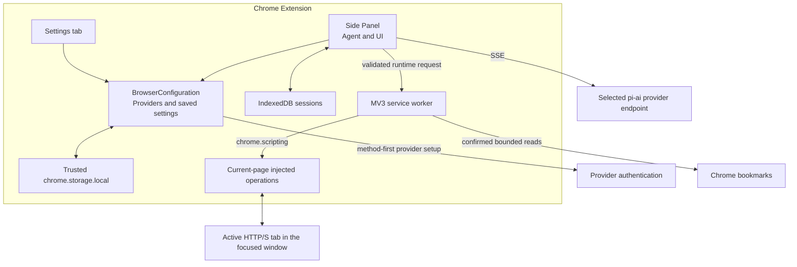

# Architecture

Pi Chrome has two trusted extension runtimes and no local companion process.

## Ownership

### Side Panel

The Side Panel entry routes conversation, full-tab Settings, and microphone-access views to separate initializers. The conversation view owns the live `Agent`, model stream, confirmation UI, queue controls, and active session; Settings owns provider/model selectors and editable instructions; both use the same credential UI controller. Credential setup selects an authentication method first, then filters the sanitized browser provider catalog to matching methods before passing the explicit provider and auth type to `pi-ai`; adding a credential does not change model selection. The Side Panel registers browser-compatible `pi-ai` providers, strips their Node-only OAuth paths, and replaces OpenAI Codex OAuth with the browser device flow. It requests optional screenshot or bookmark access only from the corresponding Confirm-button gesture. Explicit Send, login, site-access, catalog-load, and cross-origin confirmation actions record app approval for their normalized exact origins. A profile-wide Web Lock serializes approval updates across the Side Panel and Settings tabs. `pi-agent-core` receives `transport: "sse"`; browser WebSocket transport is not used.

`BrowserConfiguration` (`src/browser/configuration.ts`) owns the credential store, browser model catalog, provider summaries, saved settings, authentication changes, and endpoint resolution. Settings uses it directly and creates no Agent, session store, or session lease. Each conversation runtime composes its own configuration instance and supplies a credential-removal hook that aborts the Agent and waits for persistence. Authentication changes remain serialized per instance; the credential store separately serializes writes across contexts.

The configured model, active conversation model, and Settings draft selection are distinct. Configuration initialization returns a model selection without applying it to a conversation. Settings can seed its selection from the opener's active model without changing saved configuration. Only the opener applies an explicitly changed model to its active session; other conversations load the settings but retain their current models. New sessions use the latest loaded configured model.

Closing the panel aborts the active agent. Complete messages and tool results are persisted at event barriers. Shutdown retains its final save after the end listener: it can recover a failed listener save and mark a run interrupted if closing raced with an idle save. The session lease is released only after that final save attempt. A record left in `running` state is changed to `interrupted` on the next startup and is never continued automatically.

### Message presentation

`src/browser/sidepanel/message-rendering.ts` owns transcript presentation and volatile, active-session-scoped view state. Message identity uses role, timestamp, tool-result call ID, and a collision index; content-block positions identify disclosures across partial and completed responses. Unchanged message nodes remain attached, while updated disclosures retain their existing nodes and open state. Image blocks reuse validated image nodes across streaming updates. The renderer restores focused controls and preserves reader scroll position unless already near the bottom. Switching sessions discards view state.

`src/browser/sidepanel/markdown.ts` is the single untrusted-HTML boundary: bundled Marked parses assistant prose with raw HTML escaped and image syntax reduced to text; DOMPurify allows only required presentation tags/attributes. A final URL check permits only absolute HTTP(S) links without embedded credentials. No remote image or script is loaded. Code and answer copy controls run only on user gesture and report pending, successful, or failed clipboard writes. Per-message/content-block controls retain that feedback across streaming updates; each click captures the current text, and older completions cannot overwrite a newer attempt. Switching sessions discards these controls with the rest of the view state. User/tool/thinking content uses `textContent`; raw messages, session storage, and model transport never contain rendered HTML or disclosure state.

### Service worker

The worker owns current-tab tracking, the selection context menu, injected DOM operations, screenshots, navigation, the read-only bookmark adapter, and the WebMCP adapter. It follows tab activation and focused-window changes, clears the target for unsupported pages, and revalidates the visible tab before every page operation. The Side Panel requests optional host, screenshot, or bookmark permissions directly from the corresponding user gesture; the worker verifies those grants before protected operations. Ordinary host checks require both Chrome permission and the app-approved exact-origin list, so screenshot `<all_urls>` access cannot independently authorize a new destination. Screenshot capture requires the optional `<all_urls>` grant because Chrome's temporary `activeTab` access does not follow tab switches, but the worker still accepts only the active visible HTTP(S) context. It accepts only the methods and JSON shapes listed in `src/browser/runtime/messages.ts`. Page operations compare their captured tab ID, URL, and context epoch with the current context; profile-scoped bookmark reads reject a tab context and are independently confirmation- and permission-gated.

`parseRuntimeRequest()` returns a method-discriminated `RuntimeRequest` union, so dispatch and method-specific handlers use validated parameter types. `REQUEST_LIMITS` in the same module supplies shared tool-schema, parser, and bookmark-adapter bounds. Outgoing messages still cross the worker's parser; types are not a substitute for runtime validation. The bookmark adapter retains its direct-call validation (including trimming before its query-length check), and worker permission and freshness checks remain independent.

### Injected operations

`chrome.scripting.executeScript` executes fixed functions from the extension bundle. No arbitrary JavaScript is accepted. Injected functions receive operation names and JSON arguments, never provider credentials or session transcripts.

`page.listElements` scans at most 2,000 top-frame DOM elements and returns at most 50 viewport-visible controls. Discovery and reference-based mutations require a sampled viewport point to hit the control itself or a descendant; an ancestor-only hit does not qualify, excluding controls clipped by overflow containers. Partially visible controls can qualify through an exposed sampled point. Discovery, reference mutations, and name collection also reject zero-opacity CSS filter functions on an element or its filtering ancestors, even when hit testing still succeeds. For slotted light-DOM controls, filter ancestry follows exposed `assignedSlot` links (including nested slot assignments), then parent elements and shadow hosts. This does not enumerate shadow-owned controls; closed-root slot assignments are not exposed by the standard DOM API. Filters on boxless `display: contents` ancestors, including default slots, do not affect rendering and are ignored. Filter checks include the nearest active `:modal`, `:popover-open`, or `:fullscreen` root, even inside a shadow tree, but exclude its outside filtering ancestors because their filters do not affect top-layer rendering. Merely having `open` or `popover` attributes does not create this boundary. Existing display/opacity ancestor checks and selector behavior are unchanged. Computed styles resolve numeric, percentage, and CSS-math opacity values; arbitrary SVG filter effects are not evaluated. Before parsing, computed filter strings longer than 4,096 UTF-16 units fail closed: controls or name sources with such a filter on themselves or a filtering ancestor are excluded. No prefix is treated as a complete filter. This caps parser input even for distinct controls sharing one large CSS declaration; it does not bound the browser's style computation or serialization. Filter visibility decisions are cached per element within each synchronous discovery or validation phase, including fingerprint name collection and click inspection. Each injected operation starts a fresh cache. Typing replaces it immediately after focus returns, before post-focus visibility and fingerprint checks, so page focus handlers cannot reuse pre-focus filter decisions. Legacy CSS-selector operations retain their existing visibility behavior. Name collection checks each non-whitespace code point's DOM Range rectangles against the viewport and requires a sampled hit on its text parent, not a covering descendant or ancestor. A visible container alone does not expose its clipped text or a clipped suffix; whitespace still separates wrapped words. Each text lookup inspects at most 100 text nodes and 256 UTF-16 units, including invisible ranges, to bound layout work. Names use visible `aria-labelledby` text, `aria-label`, associated labels, visible non-editable text, then placeholder, capped at 256 characters; role text is capped at 64 characters. Password/file controls and associated labels are excluded; values, editable text, and full HTML are not collected. Traversal and name lookup are bounded. Structured discovery JSON is capped at 48 KB, reserving space within the 50 KB final untrusted tool-text budget.

Each discovery creates one random-ID snapshot. The isolated world stores actual DOM nodes, action metadata fingerprints, and form identity; page scripts cannot access this registry. The worker retains only volatile snapshot metadata tied to the exact tab context. Snapshot expiry is five minutes. A new discovery replaces the old snapshot; navigation, activation, and focus events invalidate worker metadata synchronously so competing asynchronous tab refreshes cannot keep an old reference alive. Worker restart also discards metadata.

Click/type accept either the legacy selector or both `snapshotId` and `ref`, never a mixture. The worker checks snapshot freshness before injection and again in the final mutation-target assertion, together with permissions and cancellation. The injected operation rejects detached/replaced nodes and changed action metadata, and rechecks visibility/editability. Fingerprints include the target's native `:disabled` state as well as its own attribute, so inherited fieldset changes require rediscovery; first-legend controls remain valid when their effective state is unchanged. Submit fingerprints use the effective submit control's resolved `formAction`, name/value payload, override attributes, encoding/validation settings, and associated form identity, including targets reached through labels or nested elements. Submitter name/value is isolated-world comparison state only; discovery results, errors, and persisted transcripts do not contain it, and editable field values are not inspected. Changing the document base URL cannot silently retarget an approved relative submit override. Focus-triggered control changes are revalidated before typing. Link inspection and the confirmed action resolve the same reference and retain destination-permission checks. A successful injected click/type result is retained if its own navigation invalidates the snapshot; it is not reported as a rejected mutation. Discovery, inspection, and cross-origin navigation authorization still require a fresh snapshot before the worker performs any deferred navigation. References in persisted transcripts are historical only; there is no fallback selector or mutation replay.

## Data flow

1. The user sends a prompt in the Side Panel.
2. The panel resolves or refreshes the selected provider credential through the serialized credential store.
3. `pi-ai` streams the selected provider/model response over SSE.
4. Valid tool arguments become typed runtime requests to the worker.
5. The worker revalidates tab context and safety conditions, then executes a bounded operation.
6. Results return to the Side Panel and are labeled as untrusted before model use.
7. The panel persists only complete transcript boundaries.

For screenshots, the worker first checks the optional `<all_urls>` grant. If it is absent, an operation-specific confirmation explains Chrome's broad capability and Pi Chrome's current-viewport limit; its Confirm gesture requests access, and the worker rechecks the grant before calling `chrome.tabs.captureVisibleTab()`. The PNG is capped at 3 MB, labeled untrusted, sent to the selected model provider, and persisted in the transcript.

For bookmarks, the model can request only a bounded text search or recent-item read. The worker first requires an operation-specific confirmation, the confirmation gesture requests missing optional access, and the worker rechecks that access before calling `chrome.bookmarks.search()` or `chrome.bookmarks.getRecent()`. Normalized results are capped at 50 items and 50 KB, labeled untrusted, sent to the selected model provider as tool results, and persisted in the transcript.

For WebMCP, the panel captures tab context and confirms before sending one confirmed operation to the worker. The worker then checks host access, and the injected adapter independently checks confirmation. This differs intentionally from tools that discover a confirmation requirement through an initial worker request; changing that sequence would change dialog and progress-event ordering.

The context-menu selection path starts from an explicit user click. It truncates the selection, labels it untrusted, and either places it in the composer or queues it as a follow-up to a running agent.

## Browser provider seam

`builtinProviders()` supplies the `pi-ai` chat catalogs and lazy response implementations. Pi Chrome excludes Amazon Bedrock because its implementation intentionally loads a Node-only AWS SDK module. It removes non-Codex OAuth objects because those flows intentionally load Node callback/PKCE modules; their API-key paths remain available. The authentication selector derives its choices only from this sanitized provider set, so an upstream Node-only OAuth method cannot appear in Chrome. `createBrowserCodexProvider()` replaces Codex's lazy Node OAuth object with the browser device-code implementation. OpenAI API keys remain on the separate `openai` provider. Azure setup additionally stores its endpoint and optional deployment mapping with the provider-scoped API-key credential.

The selected provider and model are persisted in settings and in every session. Before a request, the Side Panel derives the selected endpoint without exposing the credential, then asks Chrome for that exact optional host origin together with the visible page origin and records those exact app approvals. Chrome can suppress its native prompt after `<all_urls>` is granted, but Pi Chrome still requires this explicit Send gesture before ordinary access. Credentials and request-time OAuth refresh share `ChromeCredentialStore`, so all credential-map writes serialize through one cross-context Web Lock and rotated tokens are committed atomically.
