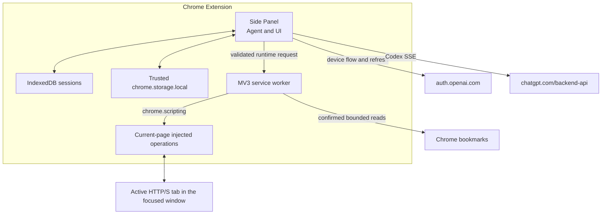

# Architecture

Pi Chrome has two trusted extension runtimes and no local companion process.

## Ownership

### Side Panel

The Side Panel owns the live `Agent`, model stream, login UI, confirmation UI, editable instructions, queue controls, and active session. It requests optional bookmark permission only from the Confirm-button gesture for a bookmark read. `pi-agent-core` receives `transport: "sse"`; browser WebSocket transport is not used.

Closing the panel aborts the active agent. Complete messages and tool results are persisted at event barriers. A record left in `running` state is changed to `interrupted` on the next startup and is never continued automatically.

### Service worker

The worker owns current-tab tracking, the selection context menu, injected DOM operations, screenshots, navigation, the read-only bookmark adapter, and the WebMCP adapter. It follows tab activation and focused-window changes, clears the target for unsupported pages, and revalidates the visible tab before every page operation. The Side Panel requests optional host or bookmark permissions directly from the corresponding user gesture; the worker verifies those grants before protected operations. It accepts only the methods and JSON shapes listed in `src/browser/runtime/messages.ts`. Page operations compare their captured tab ID, URL, and context epoch with the current context; profile-scoped bookmark reads reject a tab context and are independently confirmation- and permission-gated.

### Injected operations

`chrome.scripting.executeScript` executes fixed functions from the extension bundle. No arbitrary JavaScript is accepted. Injected functions receive operation names and JSON arguments, never OpenAI credentials or session transcripts.

## Data flow

1. The user sends a prompt in the Side Panel.
2. The panel resolves or refreshes the OpenAI credential through the serialized credential store.
3. `pi-ai` streams the Codex response over SSE.
4. Valid tool arguments become typed runtime requests to the worker.
5. The worker revalidates tab context and safety conditions, then executes a bounded operation.
6. Results return to the Side Panel and are labeled as untrusted before model use.
7. The panel persists only complete transcript boundaries.

For bookmarks, the model can request only a bounded text search or recent-item read. The worker first requires an operation-specific confirmation, the confirmation gesture requests missing optional access, and the worker rechecks that access before calling `chrome.bookmarks.search()` or `chrome.bookmarks.getRecent()`. Normalized results are capped at 50 items and 50 KB, labeled untrusted, sent to OpenAI as tool results, and persisted in the transcript.

The context-menu selection path starts from an explicit user click. It truncates the selection, labels it untrusted, and either places it in the composer or queues it as a follow-up to a running agent.

## Browser OAuth seam

`openaiCodexProvider()` supplies the model catalog and Codex response implementation. `createBrowserCodexProvider()` replaces only its lazy Node-oriented OAuth object with the browser device-code implementation. Both login and request-time automatic refresh use the same `ChromeCredentialStore`, so rotated refresh tokens are written under the same serialized mutation lock.
