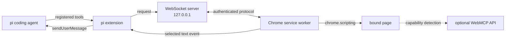
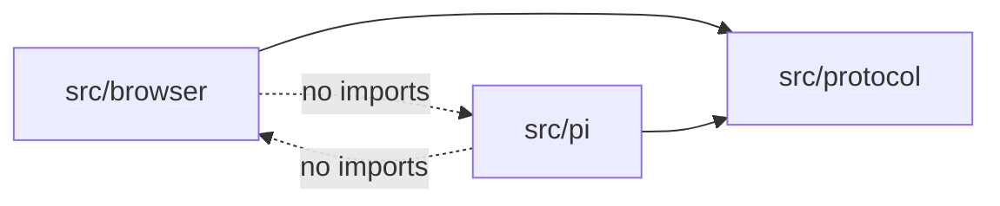

# Architecture

## Product boundary

The MVP augments an existing interactive pi session. Chrome is not a replacement chat UI and does not start pi. One local Chrome extension connects to one pi process and operates one tab that the user explicitly binds.

## Architecture decisions

### Loopback WebSocket is the process transport

Chrome initiates the connection because an MV3 extension cannot listen on a local socket. WebSocket provides request/response correlation and events without polling. Chrome sends a heartbeat every 20 seconds, below the 30-second MV3 activity window supported since Chrome 116, and reconnects with bounded exponential backoff.

The pi extension starts the server during `session_start` and closes it during `session_shutdown`. Session replacement and `/reload` therefore do not leave a listener, timer, or connection owned by the old extension instance.

### WebMCP is a page adapter

WebMCP exposes page-owned tools to an in-browser agent. It does not connect Chrome to a local process. `browser_webmcp` uses feature detection inside the bound page and fails with `NOT_SUPPORTED` when the API is absent. DOM-based capabilities remain available independently.

### Native Messaging is deferred

Native Messaging improves OS-level installation and extension-ID allowlisting, but Chrome launches a separate host process. Connecting that host to an already-running pi TUI still requires a broker and IPC lifecycle. It is not necessary for the local MVP.

### pi RPC mode is a separate product shape

If Chrome becomes a complete pi client, a native helper should launch `pi --mode rpc` and proxy its JSONL stream. Expanding this bridge into a second full session protocol would duplicate pi RPC behavior.

## Source ownership

- `src/protocol` contains browser-safe JSON types, validation, limits, and errors. It imports neither Node nor Chrome APIs.
- `src/browser` owns MV3 lifecycle, pairing storage, tab binding, permissions, DOM operations, and the optional WebMCP adapter.
- `src/pi` owns persistent pairing configuration, authentication, the loopback server, pi commands, tools, confirmations, and Chrome-to-pi message delivery.

## State and lifecycle

### Pairing state

Pi stores `{port, secret, allowedExtensionId}` outside the session transcript. Chrome stores `{port, secret, clientId}` in `chrome.storage.local`. The current `boundTabId` lives in `chrome.storage.session`, so it survives an MV3 service-worker restart but is cleared when Chrome restarts. A new `/chrome-pair` secret clears the previously bound extension ID. The first client that proves knowledge of the new secret becomes the bound extension.

### Tab state

A tab context is `{tabId, url, epoch}`. The extension increments the epoch when navigation starts or Chrome reports a URL change and sends `tab.changed`. Every pi request carries the context captured when the operation begins; a confirmation retry reuses that exact context. Chrome rechecks the live tab and rejects a mismatch with `STALE_CONTEXT`.

### Connection state

The pi server accepts only one authenticated client. A newly authenticated instance replaces the previous connection. Pending requests are rejected on disconnect, timeout, cancellation, session shutdown, or pairing rotation.

## Deployment artifacts

One repository produces two artifacts:

- `dist/chrome`: Extension.js production build and optional store zip;
- `dist/packages/pi-chrome-<version>.tgz`: pi package containing documentation, `src/pi`, `src/protocol`, and runtime dependency metadata.

The shared protocol stays source-compatible because both artifacts are built from the same version and negotiate `PROTOCOL_VERSION` during authentication.
