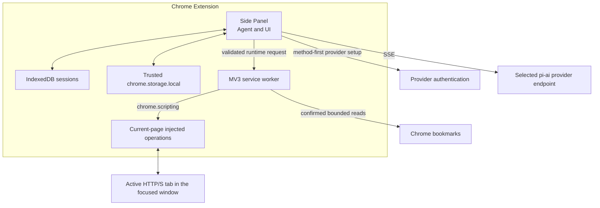

# Architecture

Pi Chrome has two trusted extension runtimes and no local companion process.

## Ownership

### Side Panel

The Side Panel entry routes conversation, full-tab Settings, and microphone-access views to separate initializers. The conversation view owns the live `Agent`, model stream, confirmation UI, queue controls, and active session; Settings owns provider/model selectors and editable instructions; both use the same credential UI controller. Credential setup selects an authentication method first, then filters the sanitized browser provider catalog to matching methods before passing the explicit provider and auth type to `pi-ai`; adding a credential does not change model selection. The Side Panel registers browser-compatible `pi-ai` providers, strips their Node-only OAuth paths, and replaces OpenAI Codex OAuth with the browser device flow. It requests optional screenshot or bookmark access only from the corresponding Confirm-button gesture. Explicit Send, login, site-access, catalog-load, and cross-origin confirmation actions record app approval for their normalized exact origins. A profile-wide Web Lock serializes approval updates across the Side Panel and Settings tabs. `pi-agent-core` receives `transport: "sse"`; browser WebSocket transport is not used.

Closing the panel aborts the active agent. Complete messages and tool results are persisted at event barriers. A record left in `running` state is changed to `interrupted` on the next startup and is never continued automatically.

### Service worker

The worker owns current-tab tracking, the selection context menu, injected DOM operations, screenshots, navigation, the read-only bookmark adapter, and the WebMCP adapter. It follows tab activation and focused-window changes, clears the target for unsupported pages, and revalidates the visible tab before every page operation. The Side Panel requests optional host, screenshot, or bookmark permissions directly from the corresponding user gesture; the worker verifies those grants before protected operations. Ordinary host checks require both Chrome permission and the app-approved exact-origin list, so screenshot `<all_urls>` access cannot independently authorize a new destination. Screenshot capture requires the optional `<all_urls>` grant because Chrome's temporary `activeTab` access does not follow tab switches, but the worker still accepts only the active visible HTTP(S) context. It accepts only the methods and JSON shapes listed in `src/browser/runtime/messages.ts`. Page operations compare their captured tab ID, URL, and context epoch with the current context; profile-scoped bookmark reads reject a tab context and are independently confirmation- and permission-gated.

### Injected operations

`chrome.scripting.executeScript` executes fixed functions from the extension bundle. No arbitrary JavaScript is accepted. Injected functions receive operation names and JSON arguments, never provider credentials or session transcripts.

## Data flow

1. The user sends a prompt in the Side Panel.
2. The panel resolves or refreshes the selected provider credential through the serialized credential store.
3. `pi-ai` streams the selected provider/model response over SSE.
4. Valid tool arguments become typed runtime requests to the worker.
5. The worker revalidates tab context and safety conditions, then executes a bounded operation.
6. Results return to the Side Panel and are labeled as untrusted before model use.
7. The panel persists only complete transcript boundaries.

For screenshots, the worker first checks the optional `<all_urls>` grant. If it is absent, an operation-specific confirmation explains Chrome's broad capability and Pi Chrome's current-viewport limit; its Confirm gesture requests access, and the worker rechecks the grant before calling `chrome.tabs.captureVisibleTab()`. The PNG is capped at 3 MB, labeled untrusted, sent to the selected model provider, and persisted in the transcript.

For bookmarks, the model can request only a bounded text search or recent-item read. The worker first requires an operation-specific confirmation, the confirmation gesture requests missing optional access, and the worker rechecks that access before calling `chrome.bookmarks.search()` or `chrome.bookmarks.getRecent()`. Normalized results are capped at 50 items and 50 KB, labeled untrusted, sent to the selected model provider as tool results, and persisted in the transcript.

The context-menu selection path starts from an explicit user click. It truncates the selection, labels it untrusted, and either places it in the composer or queues it as a follow-up to a running agent.

## Browser provider seam

`builtinProviders()` supplies the `pi-ai` chat catalogs and lazy response implementations. Pi Chrome excludes Amazon Bedrock because its implementation intentionally loads a Node-only AWS SDK module. It removes non-Codex OAuth objects because those flows intentionally load Node callback/PKCE modules; their API-key paths remain available. The authentication selector derives its choices only from this sanitized provider set, so an upstream Node-only OAuth method cannot appear in Chrome. `createBrowserCodexProvider()` replaces Codex's lazy Node OAuth object with the browser device-code implementation. OpenAI API keys remain on the separate `openai` provider. Azure setup additionally stores its endpoint and optional deployment mapping with the provider-scoped API-key credential.

The selected provider and model are persisted in settings and in every session. Before a request, the Side Panel derives the selected endpoint without exposing the credential, then asks Chrome for that exact optional host origin together with the visible page origin and records those exact app approvals. Chrome can suppress its native prompt after `<all_urls>` is granted, but Pi Chrome still requires this explicit Send gesture before ordinary access. Credentials and request-time OAuth refresh share `ChromeCredentialStore`, so all credential-map writes serialize through one cross-context Web Lock and rotated tokens are committed atomically.
