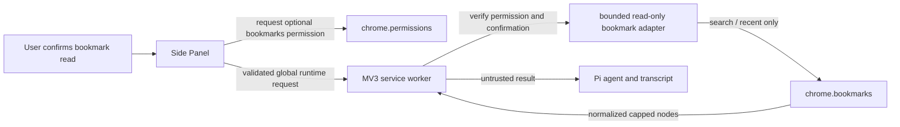

# Read-only Chrome bookmark access plan

## Goal

Let the Pi Browser Agent agent search and inspect a bounded set of Chrome bookmarks after explicit user approval, without adding any bookmark mutation path or broadening the extension's default install-time access.

## Context

- `manifest.json` currently declares no `bookmarks` permission, and `scripts/audit-artifact.mjs` allowlists only the existing required permissions and optional hosts.
- Agent tools in `src/browser/agent/browser-tools.ts` currently obtain a visible HTTP(S) tab context before every runtime request. Bookmark reads are profile-scoped and must use a separate, non-tab-bound request path.
- `src/browser/runtime/messages.ts` is the allowlist and shape validator for Side Panel-to-worker calls; `src/browser/service-worker.ts` owns privileged Chrome API execution.
- The existing confirmation dialog can request host access from its Confirm-button user gesture. Chrome requires optional API permissions to be requested from such a user gesture.
- Bookmark tool results become model input and persisted transcript content. Titles and URLs therefore leave the browser for the configured OpenAI service and remain in IndexedDB until session retention or deletion removes them.
- Chrome's `bookmarks` permission covers the full API, including writes. The implementation can be read-only only by exposing and testing no create, update, move, or remove path.

References:

- [Chrome Bookmarks API](https://developer.chrome.com/docs/extensions/reference/api/bookmarks)
- [Chrome Permissions API](https://developer.chrome.com/docs/extensions/reference/api/permissions)

## Architecture

- Declare `bookmarks` under `optional_permissions`, not required `permissions`.
- Request the optional permission only from the bookmark confirmation's explicit Confirm-button gesture. Keep per-operation confirmation even after the permission is granted because page content and model output are untrusted.
- Add two non-tab-bound tools: `browser_search_bookmarks` for a required text query and `browser_get_recent_bookmarks` for a caller-selected bounded count.
- Route both tools through validated runtime methods and a focused bookmark adapter owned by the service worker. The adapter will call only `chrome.bookmarks.search()` and `chrome.bookmarks.getRecent()`.
- Normalize results to the fields needed by the model, cap result count at 50, apply the existing 50 KB structured-result boundary, and label the result as untrusted bookmark data.
- Require `confirmed: true` and a currently granted `bookmarks` permission in the worker for every bookmark read. Bookmark requests do not carry or validate `TabContext`.

## Non-Goals

- Creating, editing, moving, deleting, importing, or exporting bookmarks.
- Reading the entire bookmark tree or recursively listing folders.
- Automatically granting bookmark access at install, login, startup, or prompt submission.
- Changing the existing requirement that a new prompt is submitted while a supported HTTP(S) page is visible; bookmark requests themselves remain independent of that tab after a run starts.
- Persisting a separate bookmark index or cache.

## Risks

- Chrome grants one broad `bookmarks` capability rather than a read-only variant. Mitigation: keep it optional, expose only two read methods, reject unknown runtime methods and parameters, and test that production code contains no mutation call.
- A prompt injection could induce the model to request bookmark data. Mitigation: require a fresh Side Panel confirmation for every read and explain that matching titles and URLs will be sent to OpenAI and saved in the session.
- Large profiles could produce excessive or sensitive output. Mitigation: require a non-empty bounded search query, cap both operations at 50 nodes, normalize fields, and enforce the existing 50 KB result limit.
- Permission revocation can race with an in-flight read. Mitigation: check immediately before the API call and map denial or API failure to a bounded `PERMISSION_DENIED` response without retrying.

## Plan

- [x] Add `bookmarks` to `manifest.json` as an optional API permission and extend `scripts/audit-artifact.mjs` to allow only that optional API permission while still rejecting it as a required permission; `npm run build` passed and `tests/unit/artifact-audit.test.ts` proves valid optional access plus required-permission and mutation-call rejection.
- [x] Extend `src/browser/permissions.ts` with narrowly named bookmark permission check/request helpers, then adapt `src/browser/sidepanel/index.ts` confirmation handling so the Confirm-button gesture requests missing bookmark access, keeps the dialog open on denial, and clearly states that returned bookmark titles and URLs are shared with OpenAI and stored in the session; permission helper coverage passed in `tests/unit/permissions.test.ts`.
- [x] Add a focused read-only bookmark adapter under `src/browser/` that validates the granted permission, calls only `chrome.bookmarks.search()` and `chrome.bookmarks.getRecent()`, normalizes bookmark/folder fields, caps results at 50, reports truncation, and converts revocation/API failures to safe runtime errors; all adapter cases passed in `tests/unit/bookmarks.test.ts`.
- [x] Add fixed `bookmarks.search` and `bookmarks.getRecent` request contracts to `src/browser/runtime/messages.ts`, including non-empty query, integer limit bounds, exact-key validation, and no required `TabContext`; route them in `src/browser/service-worker.ts`, require `confirmed: true`, and apply the 50 KB structured-result cap. Runtime-message and service-worker tests passed for malformed requests, missing confirmation, missing permission, successful global reads, and byte truncation.
- [x] Extend `src/browser/agent/browser-tools.ts` with a non-tab-bound request helper and the `browser_search_bookmarks` and `browser_get_recent_bookmarks` tools; mark each operation untrusted, confirmation-gated, sequential, and never replayed. Tool tests passed for schemas, replay/execution metadata, confirmation behavior, and absence of active-tab state requests.
- [x] Extend `tests/e2e/sidepanel-roundtrip.spec.ts` with a test-only profile bookmark and pre-granted bookmark permission in the copied test manifest, then prove a mocked model call reaches the worker, displays per-read confirmation, returns only the bounded matching bookmark data, labels it untrusted, and leaves the bookmark unchanged. The 11-test Chrome for Testing suite passed, including in-dialog permission-denial feedback; native optional-permission acquisition remains in manual acceptance because Chrome owns that prompt.
- [x] Update `README.md`, `docs/architecture.md`, `docs/permissions-and-storage.md`, `docs/security.md`, and `docs/manual-acceptance.md` to document optional access, the broad Chrome warning versus the read-only implementation, per-read confirmation, OpenAI/transcript data flow, limits, revocation behavior, and a stable-Chrome test for granting and declining the native permission prompt.
- [x] Run `npm run check`, `npm test`, `npm run build`, and `npm run test:e2e`; `npm run ci` passed with 110 Vitest tests and 11 Playwright tests. The built manifest contains optional `bookmarks`, no required bookmark or production host expansion, and no mutation call in `src` or `dist/chrome`; `npm audit --omit=dev` found no vulnerability.
- [ ] Perform the bookmark cases in `docs/manual-acceptance.md` on stable Chrome: decline and grant the native optional-permission prompt, approve and cancel individual reads, search and recent lookup, revoke access during normal use, verify no bookmark changes, and record the Chrome version and results for release review. Not run: this environment has Chrome for Testing 153.0.8010.12 but no stable Chrome executable or graphical browser session; headless Chrome leaves the browser-owned optional-permission prompt unresolved.

## Rollback / Recovery

Remove the two agent tools, runtime methods, bookmark adapter, confirmation branch, and `optional_permissions` entry together, then rebuild and rerun the artifact audit. No bookmark data is stored in a separate database, so rollback requires no migration. Existing bookmark tool results may remain in saved session transcripts and must be removed through session deletion or **Clear all session data**.

## Completion Checklist

- [x] Production code exposes bounded search and recent reads but no bookmark mutation operation; source/artifact search and the negative artifact test enforce this boundary.
- [x] Bookmark access is absent by default, requested only from an explicit user gesture, and checked again by the service worker for every read.
- [x] Every bookmark read requires an operation-specific confirmation and works without a tab-bound runtime context.
- [x] Results are normalized, capped at 50 items and 50 KB, labeled untrusted, and documented as OpenAI/transcript data.
- [x] Unit, integration, end-to-end, build, typecheck, formatting, and artifact-audit checks pass through `npm run ci`.
- [ ] Stable-Chrome optional-permission and revocation acceptance evidence is recorded. Pending a stable Chrome executable and graphical browser session.
