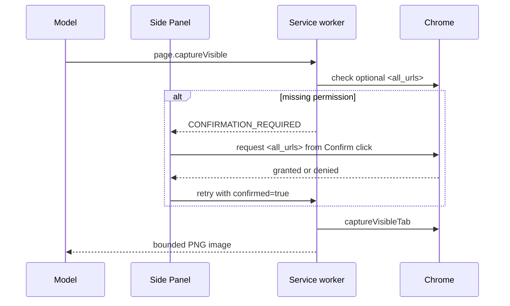

# Optional Screenshot Permission Plan

## Goal

Make `browser_capture_visible` work after tab switches by requesting Chrome's `<all_urls>` host permission only when the user approves the first screenshot, while keeping screenshot capture limited to the visible HTTP(S) tab.

## Context

- `chrome.tabs.captureVisibleTab()` requires either a live per-tab `activeTab` grant or `<all_urls>`.
- Pi Chrome's Side Panel follows newly active tabs, but `activeTab` is temporary and is not granted merely by switching tabs.
- The current per-origin host grants support page operations but do not satisfy the screenshot API requirement.
- The E2E fixture currently injects required `<all_urls>`, which proves capture but bypasses the production permission path.
- Chrome requires optional permission requests to run from a user gesture. Pi Chrome's existing confirmation button provides that gesture.

## Architecture

The broad host capability remains optional. Pi Chrome continues to reject non-HTTP(S) targets, capture only the active visible viewport, cap screenshots at 3 MB, and send the resulting image to the selected model provider and session transcript.

## Plan

- [x] Add a named `<all_urls>` screenshot permission constant plus check/request helpers, and prove their exact Chrome API calls in `tests/unit/permissions.test.ts`; the focused and full unit suites pass.
- [x] Declare `<all_urls>` under `optional_host_permissions`, keep it absent from required `host_permissions`, and extend the artifact audit/tests to require the optional declaration; the production artifact audit passes.
- [x] Gate `page.captureVisible` in the service worker: return an operation-specific confirmation when access is absent, recheck after confirmation, and fail closed on denial or revocation; Chrome E2E reaches the new confirmation path.
- [x] Extend the Side Panel confirmation gesture to request screenshot access and keep the dialog open with a clear denial message when Chrome declines it; Chrome E2E verifies the in-dialog denial.
- [x] Strengthen the screenshot tool description and unit coverage so the model attempts the tool and receives image content after the permission flow; tool tests verify the confirmed retry and PNG content.
- [x] Update README, architecture, permissions/storage, security, troubleshooting, and manual acceptance documentation with the optional broad grant, data flow, revocation behavior, and current-tab limitation.
- [x] Run formatting/lint checks, unit tests, typecheck, production build and artifact audit, and Chrome E2E coverage; `npm run ci` passes with 132 unit tests and 14 E2E tests. A manual grant produced a PNG that the model read successfully; native decline, revocation, and explicit cross-tab acceptance remain manual-only.

## Risks

- `<all_urls>` is a broad Chrome capability. It must remain optional and be requested only from the screenshot confirmation gesture.
- Chrome owns the native permission prompt; headless automated tests may not complete it. Pure permission helpers, confirmation routing, artifact policy, and the already-working capture path provide automated coverage, with stable-Chrome grant/deny/revoke cases retained in manual acceptance.
- Granting `<all_urls>` could technically enable broader host access. Runtime tab binding, HTTP(S)-only checks, stale-context validation, and fixed browser tools continue to constrain what Pi Chrome exposes.

## Completion Checklist

- [x] A production build declares optional `<all_urls>` and no required host permission.
- [x] First screenshot without the grant explains and requests access from the Confirm click; automated coverage verifies routing and denial, while the Chrome-owned native prompt remains manual acceptance.
- [ ] Granting access returns a PNG tool result, while denial or revocation fails without background permission requests; automated coverage passes, and a 2026-09-20 manual grant produced a PNG and successful model translation after one expected stale-context retry. Native revocation and explicit cross-tab acceptance remain pending.
- [x] Existing page, bookmark, provider, session, security, and E2E checks pass in `npm run ci`.
- [x] Documentation clearly states the breadth of Chrome's grant and Pi Chrome's narrower runtime behavior.
