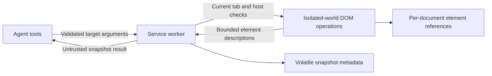

# Element Discovery and Message Rendering Plan

## Goal

Improve browser action targeting and conversation readability without expanding browser permissions or weakening confirmation checks:

1. Let the agent discover visible interactive elements and use snapshot-scoped short references for existing click and type operations.
2. Render assistant Markdown safely, collapse thinking separately from answers, and preserve disclosure state during streaming.

Implementation is authorized on `narumi/feat/element-discovery-message-rendering`, based on `origin/main` at `dfc0451`. Stable Chrome Side Panel manual acceptance remains required; no stable Chrome executable is available in this environment.

## Context

- `src/browser/agent/browser-tools.ts` exposes CSS-selector-based click/type tools, but `browser_read_page` returns text without element locators.
- `src/browser/content/page-operations.ts` owns injected DOM operations and viewport visibility checks. Its injected function must remain self-contained because `executeScript` does not carry module helpers into the page.
- `src/browser/runtime/messages.ts` validates method-specific argument shapes and bounds. `src/browser/service-worker.ts` checks exact-origin approval, Chrome permissions, and tab ID/URL/epoch before operations.
- `src/browser/sidepanel/conversation-page.ts` renders text with `textContent`. Tool messages already use collapsed `
`, except image results and text starting with “Error”. Thinking is inline, and rebuilding the transcript on every update resets disclosure state and scroll position.
- Rendering tests live in `tests/unit/conversation-message-rendering.test.ts`; DOM, tool, and message-contract tests already exist. `tests/e2e/sidepanel-roundtrip.spec.ts` runs the built extension with mocked provider SSE responses.
- `package.json` has no direct Markdown parser or sanitizer dependency. `npm run ci` runs lint, unit/integration tests, production build, typecheck, artifact audit, and Playwright tests.

## Non-Goals

- Page-scrolling, wait, or select/checkbox-specific tools; arbitrary JavaScript, coordinate clicks, iframe or Shadow DOM traversal.
- Background or multi-tab access, broader host permissions, new providers, or changes to authentication.
- Conversation search/export, prompt templates, syntax highlighting, rendered diagrams, remote Markdown images, or new session storage formats.
- Automatically replaying failed or interrupted mutations, including when an element reference expires.

## Architecture

### Element discovery and reference lifecycle

- Add `browser_list_elements` backed by `page.listElements`. Discover only top-frame, viewport-visible native controls and supported ARIA-role equivalents; report which existing actions are supported rather than claiming full accessibility-tree coverage.
- Return `{ snapshotId, elements, truncated }`. Each element has a short `ref`, bounded name, role/tag/type, supported actions, and relevant disabled/read-only state. Use a documented name fallback from labels, ARIA text, visible non-editable text, and placeholder; do not collect field values, editable contents, hidden text, full HTML, or arbitrary attributes. Exclude password/file controls and associated sensitive targets.
- Start with at most 50 returned elements, at most 2,000 inspected candidates, and names capped at 256 characters. Stop at the scan or result budget and report truncation. Preserve valid structured output and keep the final untrusted tool text within the existing 50 KB limit, including JSON escaping and wrapper overhead.
- Store actual node references only in the extension's isolated world, never in page-visible attributes. Keep one bounded snapshot per document and volatile worker metadata tying its random ID to the exact tab context. A short reference alone is not a valid target.
- Expire snapshots after five minutes and invalidate them on a replacement snapshot, navigation/reload, visible-context changes, or worker restart. Do not persist reference registries in session storage; saved tool results are historical data, not fresh targets.
- Extend click/type arguments to accept exactly one target form: the existing `selector`, or `{ snapshotId, ref }`. Keep the selector path compatible. Unknown/expired snapshots, detached or replaced nodes, and changed action-relevant metadata fail closed with a bounded error directing the agent to discover again; never fall back to a guessed selector.
- Reference resolution feeds the existing operation safety checks. Recheck visibility, editable state, sensitive controls, and action-relevant metadata after asynchronous target checks and confirmation. Submits, downloads, and cross-origin navigation retain existing confirmation and destination-permission requirements. Both `inspectClick` and the final click must resolve the same captured target.
- Keep injected DOM helpers self-contained in `page-operations.ts`. Add shared target types and limits at the existing runtime boundary rather than introducing a second browser-operation transport.

### Message presentation

- Extract message rendering from `conversation-page.ts` into a focused `src/browser/sidepanel/message-rendering.ts`; keep browser-agent lifecycle and confirmation ownership in the conversation controller.
- Add a small `src/browser/sidepanel/markdown.ts` boundary for a bundled browser-compatible Markdown parser and sanitizer. Support headings, lists, emphasis, links, fenced code, and tables. Treat model output as untrusted even when it resembles valid Markdown.
- Disable raw HTML. Allow only the required output tags and attributes; reject executable/non-HTTP(S) URLs, embedded content, forms, inline styles, and Markdown images. Links require an explicit user click and use `noopener noreferrer`; no rendering-triggered network fetches or navigation. Existing validated raster-image message blocks retain their separate renderer.
- Render assistant prose as Markdown; keep user text, tool arguments/results, and thinking as plain text. Keep raw message data unchanged for persistence and future model requests. Incomplete streamed Markdown must remain inert and readable.
- Use separate, default-collapsed disclosures for thinking, tool calls, and tool results so mixed assistant messages do not hide the answer. Preserve existing default expansion for image results; use structured `isError` for error results. Summaries show tool identity and error status without exposing the full payload.
- Keep disclosure state in memory, scoped to the active session and stable message/content-block identity. Preserve state and keyboard focus across streaming-to-completed transitions; default state applies only to newly seen blocks. Session reload may restore default disclosure state without a schema change.
- Add copy buttons for assistant answers and fenced code using the original text, only on user gesture. Report clipboard denial without adding permissions. Retain stable image nodes, and follow the bottom of the transcript only when the user was already near it.

## Resolved implementation choices

- Separate `executeScript` calls retain isolated-world node identity without exposing the registry to page JavaScript. Production-extension tests confirm replacement/reload/tab-change invalidation and real MV3 worker restart behavior.
- Marked 18.0.13 and DOMPurify 3.4.15 are pinned, browser-bundled, and verified under the unchanged MV3 CSP and artifact audit. Final size and audit evidence are recorded below.
- Stable Chrome Side Panel manual acceptance is still an external requirement, not replaced by the automated Chrome for Testing harness.

## Risks

- Dynamic pages may invalidate references frequently. Prefer a clear rediscovery error to silently retargeting another element. Revalidation reduces stale-target errors but cannot make arbitrary page event handlers trustworthy or atomic.
- Element labels can contain private information or prompt injection. Limit metadata, exclude values, use existing approved-origin access, and wrap discovery results as untrusted input.
- Markdown introduces an extension-page injection boundary. Keep one sanitization path, test adversarial content, and prohibit remote rendering resources rather than relying on CSP alone.
- Transcript replacement can disrupt focus, scroll, and expanded blocks. Cover these behaviors with streamed browser tests, not only final-output snapshots.

## Plan

### 1. Resolve implementation prerequisites

- [x] Prove isolated-world reference storage with the built extension on a fixture page: retain the same node across injections, demonstrate that page scripts cannot access the registry, and reject references after node replacement, reload, tab changes, and worker restart. Record the chosen lifecycle and browser version here; revise the design before continuing if the probe fails.
- [x] Select bundled Markdown parsing/sanitization dependencies and prove headings, tables, incomplete fences, and malicious HTML/URLs render safely under MV3 CSP. Verify `npm run build` and `npm audit --omit=dev`, record package versions and bundle-size delta, and resolve or explicitly accept any production advisory before continuing.

### 2. Add safe element discovery and targeting

- [x] Define discovery and mutually exclusive target contracts in `src/browser/runtime/messages.ts` and shared runtime types/limits. Extend `tests/unit/runtime-messages.test.ts` to prove legacy selectors remain accepted while malformed, mixed, missing, oversized, and unknown-key arguments are rejected.
- [x] Implement bounded discovery and isolated-world node resolution in `src/browser/content/page-operations.ts`. Extend `tests/unit/page-operations.test.ts` to verify name fallback, duplicate labels, visibility/occlusion, scan/result/UTF-8 limits, sensitive-input exclusion, absence of field values, and failure after node replacement or action-relevant metadata changes.
- [x] Wire snapshot lifecycle and reference-based inspection/mutations through `src/browser/service-worker.ts`. Add focused worker integration tests proving expiration/invalidation, permission revocation, confirmation decline/abort, changes while confirmation is open, and changed cross-origin destinations never produce a mutation or redirect to another target.
- [x] Register `browser_list_elements` and extend click/type tool schemas and descriptions in `src/browser/agent/browser-tools.ts`. Ensure discovery is untrusted, reference operations retain sequential/non-replayable mutation behavior, and the final encoded result stays within 50 KB; verify with browser-tool tests and a mocked discovery → type → click sequence.

### 3. Improve message rendering

- [x] Extract message rendering into `src/browser/sidepanel/message-rendering.ts` without changing behavior first. Move the rendering-test import and verify existing text projections, tool metadata, error previews, and stable raster-image nodes with `tests/unit/conversation-message-rendering.test.ts`.
- [x] Implement the restricted Markdown boundary in `src/browser/sidepanel/markdown.ts` and integrate it for assistant prose only. Add tests for supported Markdown, code escaping, HTML/SVG/event-handler payloads, encoded executable URLs, remote images, malformed/incomplete streaming input, and restored transcripts; verify rendering cannot execute code or trigger resource requests.
- [x] Implement block-level thinking/tool disclosures and in-memory disclosure identity in the renderer/controller. Verify mixed text/thinking/tool messages keep the answer visible, structured errors and image results retain their defaults, and user toggles/focus survive stream updates and completion without leaking state across sessions.
- [x] Add answer/code copy controls and scoped Markdown/disclosure styling in `src/browser/sidepanel/styles.css`. Verify exact copied text and clipboard-denial feedback, keyboard controls, light/dark themes, 12–24 px fonts, and 320/360 px panel widths; wide code/tables may scroll locally but must not cause page-level horizontal scrolling. Verify scrolling does not jump to the bottom while reading earlier messages.

### 4. Validate and document both features

- [x] Extend `tests/e2e/sidepanel-roundtrip.spec.ts` with mocked provider responses that consume actual discovered references, safely type/click, reject stale references, and require existing sensitive-action confirmations. Add streamed Markdown/disclosure, resumed-transcript, image, clipboard, focus, scroll, and hostile-content cases; verify them against a fresh production build.
- [x] Update `README.md`, `docs/architecture.md`, `docs/security.md`, and `docs/manual-acceptance.md` to document discovery scope/limits, reference expiry, unchanged permission boundaries, and rendering behavior. Review each documented behavior against an automated test or a named manual check.
- [x] Run `npm run ci`, `npm audit --omit=dev`, and `git diff --check`; record results here. Confirm `manifest.json`, credential handling, session schema, and automatic mutation-replay behavior remain unchanged.
- [ ] Perform the new manual cases in stable Chrome using the actual Side Panel: discover and operate a harmless form, decline/approve a submit, invalidate references by navigation and DOM replacement, review a streamed Markdown answer, toggle thinking/tools, copy text, and inspect narrow-panel keyboard/scroll behavior. Record Chrome version and outcomes; leave unavailable checks open rather than substituting the headless harness.

## Review follow-up

- R1, [review comment 4058963395](https://github.com/narumiruna/pi-chrome/pull/40#discussion_r4058963395), confirmed P2/in scope and fixed: four new regressions failed before the fix, reproducing lost success/denial feedback for Copy answer and Copy code after a streamed rerender. Message/block-scoped controls now retain pending/result feedback, capture text on each click, ignore older attempt completions, and isolate sessions. Seven added unit cases and the extended incremental-SSE browser case cover these paths, including unavailable/throwing clipboard APIs. Focused rendering/Markdown tests passed (26 tests), followed by the full checks below; reopened automated tasks are checked again.
- R2, current-state evidence: PR #40 was marked ready for review on 2026-09-21 at 02:46:05 UTC. Current handoff wording reflects that status without changing it or treating readiness as the missing stable Chrome manual acceptance.
- R3, [review comment 4059014417](https://github.com/narumiruna/pi-chrome/pull/40#discussion_r4059014417), confirmed P2/in scope and fixed: four new unit regressions and a native Chrome layout test failed before the fix, reproducing ancestor-clipped controls being discovered and references permitting click/type. Discovery/reference operations now require a sampled hit on the target or a descendant, including the post-focus typing check. Six new unit cases and one production-extension browser case cover ancestor/body hits, partial visibility, descendant hits, clipping after discovery, and changes during worker assertions/focus handlers. The established nested CSS-selector behavior is unchanged. Focused tests passed (53 unit/integration cases and the native clipping E2E case), then full CI passed; reopened tasks and criteria are checked again.
- R4, [GitHub CI run 35557088190](https://github.com/narumiruna/pi-chrome/actions/runs/35557088190), validation failure repaired: the streamed Markdown E2E test captured an intermediate CSS smooth-scroll position (871 versus 874). It now waits for the intended reader position of 10 before the next delta, retaining the exact scroll-preservation assertion. Mock-stream restore closes the stream idempotently and waits for Ready even on failure. Five repetitions and full local CI (240 unit/integration plus 24 E2E tests) pass. A temporary fault-injection probe verified early-failure teardown reaches Ready; the probe was removed before final validation.
- R5, deferred P3/out of scope: downstream confirmation failures were not proven stream leakage. The fault-injection probe showed the restarted Playwright worker lacks provider credentials, and base `dfc0451` already has the same provider-dependent bookmark test without its own credential setup. Recommend a separate test-fixture isolation PR; no issue or PR was created. The full ordered suite still must pass for this PR.
- Reviewed all submitted reviews, inline comments, and conversation threads; the remaining review/completion boilerplate adds no substantive request. No clarification request remains. Stable Chrome acceptance remains blocked below.

## Execution Evidence

- Baseline: 178 tests passed before feature changes; production artifact was 3,060,140 bytes.
- Isolated-world prototype passed in Chrome for Testing 153.0.8010.12. Production E2E tests `discovers isolated node references...` and `invalidates references on a real MV3 worker restart` passed, including page-world isolation, DOM replacement, reload, tab switches, and an actual CDP worker stop/restart. A worker-global sentinel proves the restart; Playwright retains its logical Worker object, so a new `serviceworker` event is not assumed.
- Dependencies: exact `marked@18.0.13` and `dompurify@3.4.15`; extension-CSP probe passed headings, tables, partial fences, raw HTML, unsafe links, and remote-image rejection. Final whole-feature artifact is 3,148,293 bytes (+88,153 bytes, approximately 2.9%, versus baseline; +262 bytes for the copy-feedback follow-up and +41 bytes for the ancestor-clipping fix). Both `npm audit --omit=dev` and `npm audit` report zero vulnerabilities.
- Rendering extraction passed the three pre-existing projection/image tests before behavior changes. Final `npm run ci` passed on Node.js 26.8.2: lint; 240 unit/integration tests across 26 files; browser bundle probe; production build/typecheck/artifact audit; 24 Playwright tests. `git diff --check` passed.
- Browser tests consume actual discovered references through mocked provider requests, type/click, cancel and approve submit, and reject stale references. Incremental SSE tests preserve thinking expansion/focus/scroll through completion; exact copying and clipboard denial pass. Wide tables/code scroll locally at 320/360 px, 12/24 px, and both themes. Restored Markdown stays inert; a user-clicked safe link has no opener or referrer. Existing screenshot/image, authentication, permission, interruption, and full-restart regressions pass.
- Code review caught a navigation-event race: asynchronous tab refresh can be superseded by another refresh. Snapshot invalidation now happens synchronously on navigation/activation/focus events, with a regression test.
- Complete tracked/new-file diff reviewed for scope, compatibility, injection safety, lifecycle, and regressions. Additional checks cover focus handlers changing input types, changed label associations/resolved link destinations, multibyte/escaped result budgets, and Copy answer focus when new code controls arrive. Late permission revocation retains `PERMISSION_DENIED` rather than misleadingly reporting stale context. No changes to `manifest.json`, credential/auth modules, session schema, or automatic mutation-replay behavior.
- Risk disposition: dynamic page handlers remain untrusted/non-atomic; stale targets fail closed. Sensitive values are excluded from discovery, and metadata remains untrusted. Parser/sanitizer output is allowlisted and covered by hostile-content/partial-stream tests. Rendering lifecycle regressions have browser coverage. The additional bundle size is bounded and requires no permission expansion.
- Initial handoff: signed implementation commit `269cec9` pushed to `narumi/feat/element-discovery-message-rendering`; [PR #40](https://github.com/narumiruna/pi-chrome/pull/40) was opened as a draft targeting `main` and has since been marked ready for review. GitHub reports the SSH signature as verified/valid. Local `git verify-commit` cannot verify without `gpg.ssh.allowedSignersFile`; no Git identity or signing configuration was changed. [GitHub CI run 35554040829](https://github.com/narumiruna/pi-chrome/actions/runs/35554040829) passed.
- Blocked: stable Chrome Side Panel manual acceptance (`docs/manual-acceptance.md`, cases 14–15). No stable Chrome executable is installed. Do not check the manual task, mark the plan complete, or delete this file until a human records those results. PR #40 is now ready for review, but that status does not satisfy the outstanding manual acceptance checks.

## Rollback / Recovery

- No session-data migration, new host permission, or credential change is planned. Existing raw transcript records remain readable by the previous renderer.
- Revert discovery contracts, tools, worker metadata, and injected registry code together; rebuilding/reloading the extension discards volatile references. Historical discovery results may remain as inert transcript content, but cannot authorize or replay mutations.
- Revert renderer integration, styles, and new parser/sanitizer dependencies together to restore plain-text presentation. Rebuild and rerun CI; do not delete sessions as a rollback step.

## Completion Checklist

- [x] The agent can discover then click/type using returned references without inventing CSS selectors; legacy selector calls still pass tests.
- [x] Expired, mismatched, detached, replaced, or changed targets fail closed, and confirmation/permission/cancellation tests demonstrate no unintended mutation.
- [x] Discovery is bounded, excludes sensitive values, remains untrusted model input, and does not expand tab scope or permissions.
- [x] Assistant Markdown is readable and inert under malicious and partial input; tool/user/thinking text and stored messages retain their intended representations.
- [x] Answers remain visible, thinking/tools have predictable disclosures, and streaming preserves expansion, focus, images, and reader scroll position.
- [ ] Copy controls, narrow layouts, theme/font variants, and resumed sessions pass automated and recorded stable-Chrome checks.
- [ ] All plan tasks have acceptance evidence, dependency/security unknowns are resolved, documentation matches behavior, and CI plus the production dependency audit have a recorded disposition.

After every task and completion check is checked, delete this completed plan and report its path. Until then, retain and update this file during authorized implementation.
