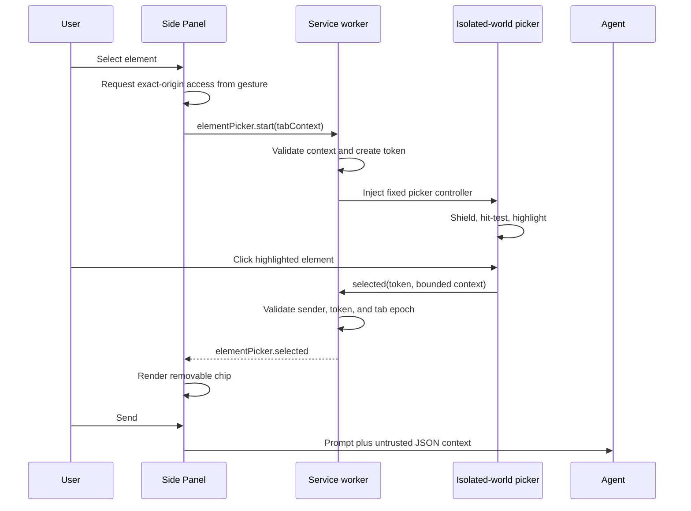

# Page Element Picker Plan

## Goal

Let a user select a visible element from the active page, review or remove a compact element chip in the Side Panel composer, and send bounded structured element context to the agent without triggering the selected element's click, navigation, or submit behavior.

## Context

- `src/browser/sidepanel/index.html` and `conversation-page.ts` own the composer, microphone, Send behavior, queued follow-ups, and tab-change events.
- `src/browser/service-worker.ts` already validates the active visible HTTP(S) tab, exact-origin access, URL/epoch freshness, and fixed `chrome.scripting` injections.
- `src/browser/content/page-operations.ts` already discovers visible interactive elements and maintains short-lived `snapshotId`/`ref` targets, but it does not provide an interactive picker or enumerate arbitrary elements.
- `BrowserAgentRuntime.submit()` currently accepts text and images only, so selected-element JSON must be deliberately serialized into the user-message channel and marked as untrusted.
- Existing discovery intentionally prefers expiring references over persistent selectors. A picker-generated CSS selector is therefore a descriptive, best-effort relocation hint, not authorization for a later mutation.

## Architecture

The worker owns the authoritative picker token and tab context. The injected controller owns one idempotent cleanup path for its shield, highlight, listeners, observers, and timeout. The Side Panel owns only active UI state and unsent selected-element attachments.

## Assumptions

- The first version supports the top frame and light DOM on the active HTTP(S) tab.
- Up to five selected elements may be attached to one message, with a combined serialized limit of 16 KB.
- Unsent selected elements are cleared on session switch or any tab-context URL/epoch change.
- A message containing selected elements but no typed text is valid.

## Non-Goals

- Selecting inside iframes, closed Shadow DOM, or shadow-owned open-root content.
- DevTools/CDP integration or a required `debugger` permission.
- Guaranteeing that page-level `window` or `document` capture listeners registered before the injection never observe an event. The selected element and its default click/navigation/submit behavior must not run.
- Treating CSS selectors, XPath, rectangles, or saved transcript data as durable mutation capabilities.
- Reading input values, password/file data, full HTML, hidden text, or unbounded attributes.

## Risks

- A normal extension overlay cannot reproduce browser-internal DevTools event interception. Mitigate with a full-viewport interaction shield and acceptance tests focused on the selected target's handlers and default actions.
- A worker restart can lose the authoritative token while injected state remains. Mitigate with page lifecycle cleanup, an expiry timeout, idempotent stop injection, and a fresh start that removes any prior picker state.
- Generated selectors can become stale or identify a different element after DOM changes. Mark them best-effort, verify uniqueness only at selection time, and require normal discovery/revalidation before mutation.
- Selected page content can contain private data or prompt injection. Bound every field, exclude editable values and HTML, label the JSON untrusted, and transmit it only when the user selects Send.

## Plan

- [x] Define `SelectedElementContext`, picker state/result contracts, and shared limits in focused runtime/side-panel modules; include page URL, tag, bounded ID/classes/text/ARIA/allowlisted attributes, viewport rectangle, viewport/scroll metadata, and a unique-at-selection-time CSS hint, and prove malformed, oversized, sensitive, and reserved-key payloads are rejected in unit tests.
- [x] Add a self-contained isolated-world picker operation under `src/browser/content/` that installs a fixed full-viewport shield and closed-shadow highlight/label, resolves the underlying top-frame element with bounded hit-testing, tracks pointer/scroll/resize/dynamic updates, and exposes one idempotent cleanup function; jsdom tests must prove start/stop replacement, bounded extraction, selector fallback, observer disposal, and no persisted input value or HTML.
- [x] Intercept pointer down/up/click, auxiliary click, double click, context menu, drag, and touch activation on the shield while allowing viewport scrolling; browser tests must prove selecting a button, link, and submit control changes no page counters, URL, or form state and removes the overlay after selection.
- [x] Extend `src/browser/runtime/messages.ts` and `src/browser/service-worker.ts` with validated picker start/stop requests and a separately validated injected-result path; require exact-origin access, bind a random token to the current tab ID/URL/epoch, reject stale or forged senders/results, and cancel on tab update, activation, focus loss, or unsupported pages, with integration coverage for every branch.
- [x] Add the cursor-and-dashed-box button immediately beside `#voice-input`, use the project icon-button/title pattern plus `aria-pressed`, and add a bounded removable chip row to the composer; Side Panel tests must prove active/disabled/error states, repeated toggles, panel and page `Escape`, element-only Send, removal, and cleanup on session/tab changes without regressing voice, pasted images, Stop, or Send.
- [x] Extend `BrowserAgentRuntime.submit()` and streaming queue construction to append versioned selected-element JSON to the user message under an explicit untrusted-data header; update the system prompt, clear only the exact submitted attachments after a submission is accepted, and verify prompt, steer, follow-up, transcript persistence, and provider request bodies contain the structured fields rather than only the chip label.
- [x] Add Playwright coverage on a controlled page for hover geometry, scroll and dynamic replacement, successful selection, prevented click/navigation/submit, removable chips, `Escape`, repeated start/stop, SPA/tab navigation cleanup, denied/revoked site access, and absence of orphan overlays after Side Panel close/reopen.
- [x] Update README, architecture, permissions/storage, security, privacy, troubleshooting, and manual acceptance documentation with the local-selection flow, provider transmission point, data limits, selector limitations, top-frame scope, revocation behavior, and manual light/dark/narrow-width checks.
- [x] Run `npm run check`, `npm test`, `npm run build`, `npm run test:e2e`, and `npm audit --omit=dev`, and record passing automated evidence.
- [ ] Complete the stable-Chrome-only acceptance items recorded in `docs/manual-acceptance.md`.

## Execution Evidence

- `npm run check`: passed, 83 files.
- `npm test`: passed, 29 files and 357 tests.
- `npm run build`: passed, including typecheck and artifact audit (23 files).
- `npm run test:e2e`: passed, 41 Playwright tests.
- `npm audit --omit=dev`: passed with zero vulnerabilities.
- Stable-Chrome browser-owned Side Panel theme/width, Chrome-UI revocation, timeout observation, residual capture-listener, and full-restart picker checks remain explicitly pending.

## Completion Checklist

- [x] The picker button appears beside the microphone and communicates active state accessibly.
- [x] Hover highlights the underlying top-frame element without changing layout, including after scroll or bounded DOM updates.
- [x] Selecting a link, button, or submit control does not execute that target's original behavior.
- [x] Selection, `Escape`, repeated toggle, navigation, tab/focus change, timeout, and Side Panel close leave no active picker overlay or reusable token.
- [x] Removable chips carry bounded structured context, and element-only prompt, steer, and follow-up submissions reach the provider as explicitly untrusted JSON.
- [x] No input value, password/file data, full HTML, credential-bearing URL, or unbounded page data enters the context.
- [x] Existing element discovery/reference safety, microphone, pasted-image, Send/Stop, session, permission, and artifact checks still pass.
- [x] Documentation states the supported scope and residual event-interception limitation accurately.
- [ ] Stable-Chrome manual acceptance remains pending.
