# Screenshot Annotation Plan

## Goal

Let a user open a completed `browser_capture_visible` tool-result image in a simple local drawing editor, circle or mark the relevant region, attach the rendered annotation to the composer, and send it as an image prompt or queued follow-up.

## Context

- `browser_capture_visible` already returns a bounded PNG image in a `toolResult` message and requires the existing optional screenshot permission flow.
- `src/browser/sidepanel/message-rendering.ts` renders validated image content and can identify screenshot results through `message.role === "toolResult"` and `message.toolName === "browser_capture_visible"`, but it currently exposes no image actions.
- `src/browser/sidepanel/conversation-page.ts` already manages removable composer images, image-capability checks, prompt/steer/follow-up submission, and clearing only submitted image IDs.
- `src/browser/sidepanel/images.ts` validates PNG/JPEG/WebP/GIF content and enforces four images and 3 MB total, but its attachment reader is currently named only for pasted images.
- Sent images are persisted inline with the session and compacted by the existing 5 MB session policy.

## Architecture

```mermaid
flowchart LR
  Result[Completed screenshot tool result] --> Renderer[Transcript image action]
  Renderer --> Editor[Local canvas annotation dialog]
  Editor -->|redraw source plus vector strokes| Preview[Annotated preview]
  Preview -->|export bounded PNG| Composer[Existing image attachments]
  Composer -->|Send / steer / follow-up| Agent[Agent and selected provider]
  Agent --> Session[Existing transcript persistence]
```

The renderer exposes an annotation callback but does not own editor state. A focused Side Panel controller decodes the existing validated screenshot, stores strokes as vectors for undo/clear, renders them over the source at image resolution, and exports one bounded PNG through the same composer-image validation path used by paste.

## Assumptions

- Annotation is offered only for completed `browser_capture_visible` tool results, not arbitrary assistant, pasted, or provider images.
- The first version provides one high-contrast pen, adjustable width, undo, clear, cancel, and attach; freehand strokes are sufficient for circles and marks.
- Opening and editing remain local. The annotated raster reaches the provider only after the user selects Send.
- Attaching while an agent run is active uses the existing steer/follow-up controls and image-capability validation.

## Non-Goals

- A full image editor with crop, text, arrows, shapes, layers, color palettes, or persistent editable stroke data.
- Mapping annotated pixels back to a DOM node or using an annotation as automatic click authorization.
- Replacing the existing screenshot permission, capture, size, session-compaction, or provider data flow.
- Editing screenshots after their image content has been removed by session compaction.

## Risks

- A small encoded PNG can still decode to a large canvas and consume substantial memory. Validate dimensions, cap decoded pixels, and proportionally downscale before editing.
- Re-encoding a screenshot with marks can exceed the composer's 3 MB total. Export through the shared attachment validator and keep the editor open with a clear error when the result does not fit.
- Transcript rerenders can replace controls or lose focus. Give annotation controls stable message/image keys and cover streaming/session transitions like existing copy controls.
- The agent may already have continued after taking the screenshot. Treat annotations as an explicit later user message or queued instruction, never as retroactive input to the completed tool call.

## Plan

- [x] Define the screenshot-annotation UX, editor limits, and testable contracts in a focused `src/browser/sidepanel/screenshot-annotation.ts` module; cap source dimensions/pixels, strokes, points, pen width, and exported bytes, and unit-test invalid image data, oversized dimensions, empty strokes, and export failure.
- [x] Refactor `src/browser/sidepanel/images.ts` and composer attachment code so pasted and generated image `Blob`s share MIME, count, total-byte, base64, and model-capability validation without changing current paste behavior; existing image tests plus new generated-image cases must pass.
- [x] Extend `TranscriptRenderer` with a stable callback-driven `Annotate screenshot` icon action only for valid `browser_capture_visible` image blocks; preserve the image node, disclosure state, button focus, and callback identity across rerenders and session changes, with unit tests proving other image types receive no action.
- [x] Add an accessible annotation dialog to `index.html` and `styles.css` with a responsive canvas, paintbrush cursor, pen-width control, Undo, Clear, Cancel, and Attach controls; support mouse, pen, and touch through Pointer Events, map display coordinates to source pixels, use pointer capture, and handle `Escape` without modifying the composer.
- [x] Implement vector stroke storage and deterministic redraw of the decoded source plus annotations, including resize-safe display, undo/clear, no-stroke prevention, and bounded PNG `toBlob()` export; unit tests must verify coordinate scaling and stroke state, while Playwright verifies visible pixels change after drawing.
- [x] Connect Attach to the existing composer image collection with a new immutable ID, removable preview, and normal Send/steer/follow-up semantics; prove image-only submission works, only successfully submitted IDs are cleared, unsupported models fail clearly, and the provider receives the annotated image exactly once.
- [x] Add Playwright coverage using a known screenshot fixture for action visibility, dialog open/cancel, pointer drawing, undo/clear, successful attach, byte-limit errors, preview removal, queued follow-up during a run, session persistence after Send, and no regression to screenshot disclosure or transcript scroll/focus behavior.
- [x] Update README, architecture, permissions/storage, security, privacy, and manual acceptance documentation to state that editing is local, annotation sends a new image only on Send, the original and annotated images can both consume session storage, and no new Chrome permission is introduced.
- [x] Run `npm run check`, `npm test`, `npm run build`, `npm run test:e2e`, and `npm audit --omit=dev`, and record passing automated evidence.
- [ ] Complete the stable-Chrome light/dark, narrow-width, touch/pen where available, interrupted-run, and Chrome-restart checks recorded in `docs/manual-acceptance.md`.

## Execution Evidence

- `npm run check`: passed, 83 files.
- `npm test`: passed, 29 files and 357 tests.
- `npm run build`: passed, including typecheck and artifact audit (23 files).
- `npm run test:e2e`: passed, 41 Playwright tests.
- `npm audit --omit=dev`: passed with zero vulnerabilities.
- Stable-Chrome touch/pen, browser-owned Side Panel theme/width, interrupted-run, and full-restart annotation checks remain explicitly pending.

## Completion Checklist

- [x] Every valid completed viewport screenshot, and only that tool result, exposes an accessible annotation action.
- [x] The editor supports pointer drawing, width adjustment, undo, clear, cancel, and Attach without modifying the original transcript image.
- [x] Canvas decode, stroke count/points, dimensions/pixels, output count, and total bytes are bounded and fail clearly.
- [x] Attach creates one normal removable composer preview; image-only prompt, steer, and follow-up submission send one annotated raster to the provider.
- [x] Cancel or `Escape` sends and stores nothing, while a sent annotation follows existing session persistence and compaction rules.
- [x] Annotation requires no new Chrome permission and does not alter screenshot confirmation, capture, microphone, paste, transcript disclosure, or session behavior.
- [x] Unit, integration, E2E, build, and artifact-audit checks pass.
- [ ] Documented stable-Chrome manual acceptance remains pending.
